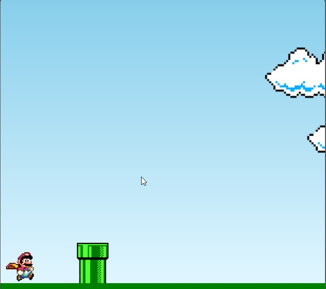
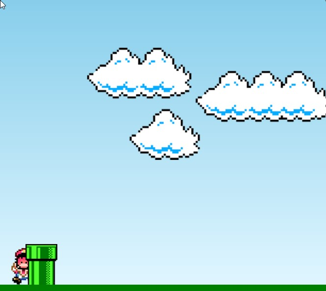
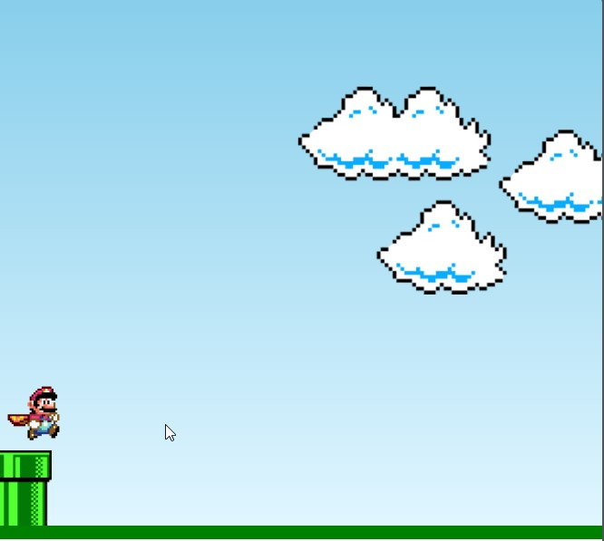

# Super Mario Game

_Uma aventura nostálgica no universo do Super Mario!_ 🍄

## Descrição

Bem-vindo ao **Super Mario Game**, uma recriação simples e encantadora do clássico **Super Mario Bros.** Desenvolvido com _HTML, CSS e JavaScript_, o jogo permite que o icônico personagem Mario pule habilmente para evitar obstáculos, representados por canos verdes, enquanto navega por um ambiente animado.

## Capturas de Tela





## Tecnologias Utilizadas

- **HTML5:** Estrutura da página web.
- **CSS3:** Estilo e layout do jogo.
- **JavaScript:** Lógica e interatividade para uma experiência envolvente.

## Instalação e Uso

1. **Clone o Repositório:**
   ```bash
   git clone https://github.com/DevAndreLuis/super-mario-game.git

## Navegue até o Diretório:

cd super-mario-game

 **Abra o Jogo:**
# Super Mario Game

Abra o arquivo `index.html` no seu navegador favorito.

Mergulhe na nostalgia e divirta-se com o Super Mario!

## Personalização

Explore a personalização do jogo editando os seguintes arquivos:

- `style.css:` Ajuste estilos e layouts conforme sua criatividade.
- `script.js:` Adicione ou modifique a lógica do jogo para uma experiência única.
- Experimente criar novos níveis, adicionar inimigos ou dar um toque especial ao Mario!

## Funcionalidades

- **Pulo do Mario:** Habilidade do Mario para evitar obstáculos.
- **Animação Infinita do Cano:** Os canos se movem continuamente na tela.
- **Game Over:** O jogo encerra se o Mario colidir com um cano.

## Observações

Contribuições são bem-vindas! Sinta-se à vontade para enviar melhorias ou novos recursos.

## Autor

AndreDev
- **GitHub:** [DevAndreLuis](https://github.com/DevAndreLuis)
- **LinkedIn:** [AndreDev](https://www.linkedin.com/in/andr%C3%A9-luis-3073aa2ab/)

## Licença

Uso livre.

## Agradecimentos

[youtube](https://www.youtube.com/watch?v=r9buAwVBDhA)
Ao canal manual do Dev que proporcionou a experiência e muito aprendizado.

### Como Contribuir:

- Envie pull requests com melhorias ou novos recursos.
- Abra issues para relatar bugs ou problemas.
- Compartilhe o projeto com seus amigos e colegas!

### Links Úteis:

- [Repositório GitHub](https://github.com/DevAndreLuis/super-mario-game)


Divirta-se jogando! 🚀🎮


